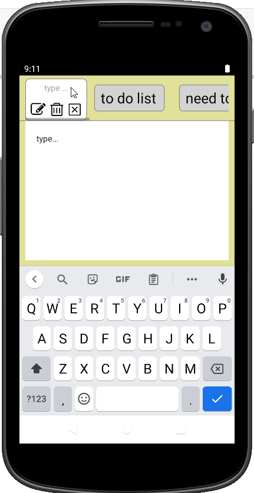

<h3>MEMO</h3>

</img>

<h3>About the project</h3>

 MEMO is a note organizer. Users can write (edit/delete) notes, change themes.
 Released on Google Play Store https://play.google.com/store/apps/details?id=com.yulia_123.Memo 

- Built with React Native.

- Used AsyncStorage for storing data.

- Integrated React Hooks for managing a component’s state and handle side-effects.

- Used Expo CLI for simplifying the development.

- Integrated EXPO icons.

- Used Android Studio Emulator for development and testing.

